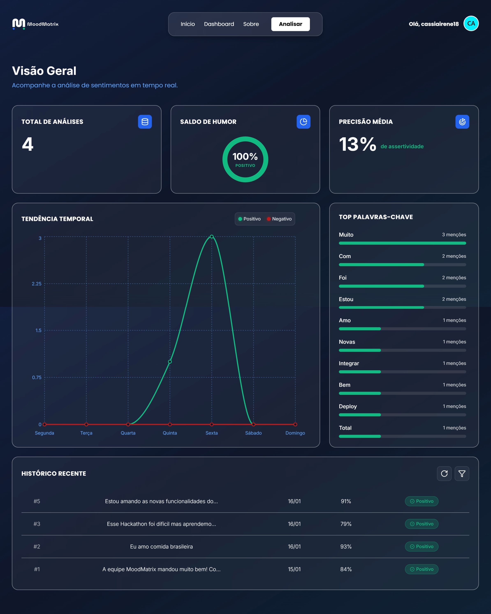
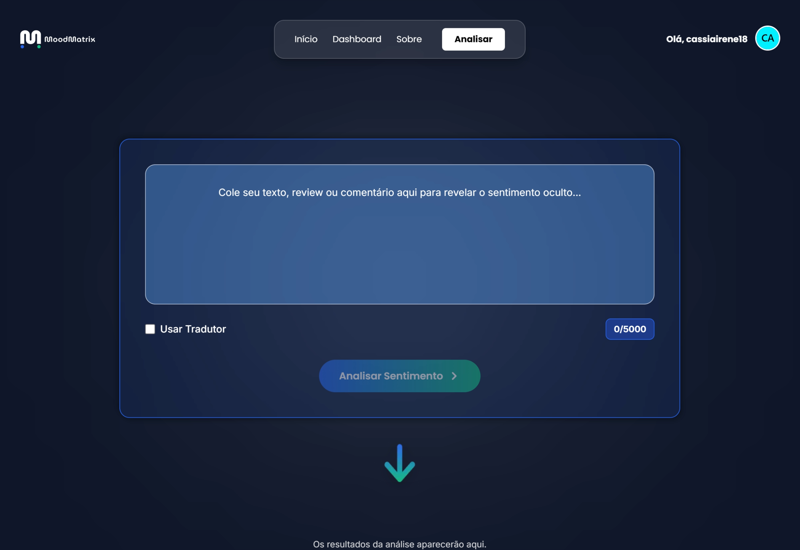
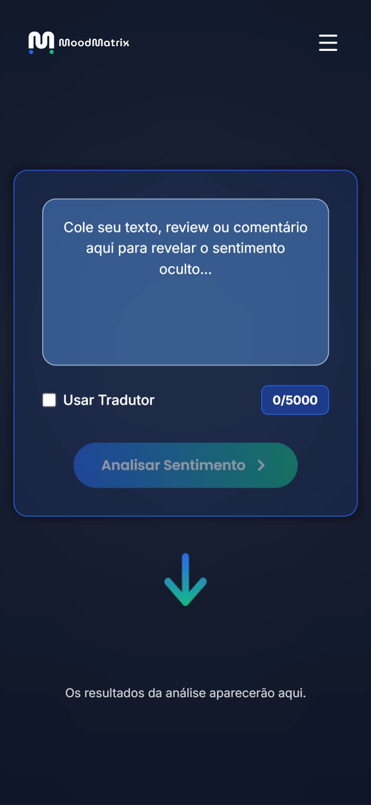

# MoodMatrix — Frontend

> **“Eliminamos a ambiguidade onde a neutralidade falha.”**

Interface **moderna, responsiva e segura** para transformar análises de sentimentos em **insights visuais acionáveis**, facilitando a tomada de decisão baseada em dados.


🔗 **Deploy:** [https://mood-matrix-frontend.onrender.com/](https://mood-matrix-frontend.onrender.com/)

---

## 🎨 Visão Geral

O **MoodMatrix Frontend** funciona como o **painel central do usuário**, abstraindo a complexidade dos modelos de Machine Learning e das APIs de backend (Java e Python).

A aplicação entrega uma experiência clara e fluida para que gestores e analistas possam:

* Monitorar sentimentos em tempo real
* Visualizar tendências
* Consultar históricos de análise
* Interagir com dados de forma intuitiva

O projeto foi desenvolvido com foco em **performance, segurança, escalabilidade e boa experiência do usuário**, utilizando o **App Router do Next.js** e autenticação robusta via **NextAuth.js**.

---

## ✨ Principais Funcionalidades

* **📊 Dashboard Analítico**
  Visualização gráfica da distribuição de sentimentos e evolução temporal dos dados.

* **⚡ Análise em Tempo Real**
  Campo de texto livre para testar frases instantaneamente, conectado à **API Python** para inferência imediata.

* **📝 Histórico de Consultas**
  Listagem das análises realizadas, com organização e leitura facilitada.

* **🔐 Autenticação Segura (NextAuth)**
  Login persistente, controle de sessão, rotas privadas e gerenciamento seguro de tokens.

* **📱 Design Totalmente Responsivo**
  Interface adaptada para **desktop, tablet e mobile**, mantendo consistência visual.

---

## 🛠️ Stack Tecnológico

A stack foi escolhida visando **robustez, segurança e produtividade**:

* **[Next.js](https://nextjs.org/)** — Framework React para aplicações em produção, com renderização otimizada.
* **[NextAuth.js](https://next-auth.js.org/)** — Autenticação segura com sessões persistentes e rotas protegidas.
* **[Tailwind CSS](https://tailwindcss.com/)** — Estilização utilitária para UI consistente e rápida.
* **[Fetch API](https://developer.mozilla.org/pt-BR/docs/Web/API/Fetch_API)** — Comunicação HTTP assíncrona e nativa.
* **[Lucide React](https://lucide.dev/)** — Ícones leves e personalizáveis.
* **[Recharts](https://recharts.org/)** — Gráficos interativos e performáticos.
* **[TypeScript](https://www.typescriptlang.org/)** — Tipagem estática para maior segurança e manutenção do código.

---

## 📂 Estrutura do Projeto

```bash
hackathon-frontend/
├── app/                 # Páginas e rotas (Next.js App Router)
├── assets/              # Imagens e arquivos estáticos do projeto
├── components/          # Componentes visuais reutilizáveis
├── public/              # Arquivos públicos (logos, favicons)
├── types/               # Tipagens TypeScript
│   ├── next-auth.d.ts   # Tipagem estendida do NextAuth
│   └── sentiment.ts     # Interfaces para dados de sentimento
├── .env.local           # Variáveis de ambiente
├── eslint.config.mjs    # Configuração do ESLint
├── next.config.ts       # Configurações do Next.js
├── tailwind.config.ts   # Configuração do Tailwind CSS
├── tsconfig.json        # Configuração do TypeScript
└── README.md            # Documentação do projeto
```

Essa organização garante **escalabilidade, legibilidade e separação clara de responsabilidades**.

---

## 📸 Screenshots

|          Dashboard Principal         |     Tela de Análise de Texto     |
| :----------------------------------: | :------------------------------: |
|  |  |

---

## 📸 Screenshots (Versão Mobile)

O design responsivo da MoodMatrix garante uma experiência fluida em qualquer dispositivo.

| Dashboard Principal | Análise de Texto em Tempo Real |
| :-----------------: | :----------------------------: |
|  |  |

---


## ▶️ Instalação e Execução Local

### Pré-requisitos

* Node.js **v18+**
* NPM ou Yarn

### Passo a Passo

```bash
# 1. Clonar o repositório
git clone https://github.com/Hackaton-ONE/hackathon-frontend.git

# 2. Acessar a pasta do projeto
cd hackathon-frontend

# 3. Instalar as dependências
npm install
```

### Configuração das Variáveis de Ambiente

Crie um arquivo `.env.local` na raiz do projeto:

```env
# APIs
NEXT_PUBLIC_API_JAVA_URL=http://localhost:8080
NEXT_PUBLIC_API_PYTHON_URL=http://localhost:8000

# NextAuth
NEXTAUTH_URL=http://localhost:3000
NEXTAUTH_SECRET=sua-chave-secreta-aqui
```

### Executar a Aplicação

```bash
npm run dev
```

A aplicação estará disponível em:
📍 `http://localhost:3000`

---

## 🔗 Integração e Segurança

A comunicação entre o frontend e os microsserviços segue uma arquitetura segura:

### 🔐 Autenticação

* O usuário realiza login via formulário.
* O **NextAuth** valida as credenciais junto à **API Java**.
* A sessão é criada utilizando **cookies HTTPOnly**, garantindo segurança contra ataques XSS.

### 🔒 Rotas Protegidas

* Rotas como `/dashboard` validam a sessão ativa.
* Usuários não autenticados são redirecionados automaticamente para o login.

### 🔁 Fluxo de Dados

* As requisições utilizam a **Fetch API**.
* O token de sessão é anexado ao header `Authorization`, garantindo acesso seguro aos dados protegidos.

---

## 🎨 Decisões de UI/UX

* **Feedback Visual Contínuo**
  Skeletons e loaders informam o estado das requisições.

* **Tratamento de Erros Amigável**
  Toasts e mensagens claras em caso de falhas de API ou validação.

* **Visualização Semântica**
  Uso de cores intuitivas:

  * 🟢 Positivo
  * 🔴 Negativo

Facilitando leitura e interpretação rápida dos dados.

